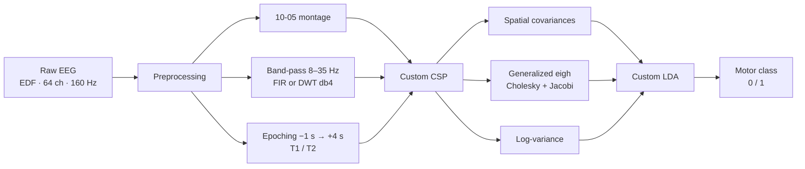

# Total Perspective Vortex

**Brain-Computer Interface** — infer a motor intent (left / right hand, hands / feet) from raw EEG.

End-to-end scikit-learn pipeline, with the critical pieces written from scratch: **CSP**, **Fisher LDA**, and the generalized eigenvalue decomposition (Cholesky + Jacobi).

<p>
  
  
  
  
  
</p>

---

## Why this project

EEG is noisy, high-dimensional, and short on trials per subject. The hard part is not calling `fit()`. It is **reducing the space** without leaking labels, **maximizing class contrast**, and **classifying a chunk in under 2 seconds**.

This repo shows that I can:

- process a real physiological signal (PhysioNet, 109 subjects, 64 channels);
- implement a **supervised** dimensionality-reduction algorithm (CSP) and ship it as a sklearn `Transformer`;
- evaluate it properly (stratified 5-fold, leak-free train / predict split);
- go beyond the assignment: custom LDA, wavelet filtering, and a second dataset (BCI Competition IV 2a).

---

## Pipeline



1. **Preprocessing** — load EDF with MNE, standardize electrode names, band-pass the µ / β sensorimotor rhythms, epoch around the stimulus.
2. **CSP** — spatial projection that maximizes one class variance and minimizes the other. Features are the log-variance of the extreme components.
3. **LDA** — Fisher axis plus a midpoint threshold. Binary classification.
4. **Stream** — replay epochs as a live feed; each prediction must land in **< 2 s** (no `mne-realtime`).

---

## What is written from scratch

Not a wrapper around `mne.decoding.CSP` / `sklearn.discriminant_analysis.LDA`. The linear algebra lives in this repo.

| Module | Role | Maths |
| --- | --- | --- |
| [`model.py`](model.py) — `CustomCSP` | Spatial dimensionality reduction | \(C_0 W = \lambda (C_0 + C_1) W\) |
| [`model.py`](model.py) — `custom_eigh` | Generalized eigenvalue problem | Cholesky \(B = LL^\top\), then Jacobi on \(L^{-1} A L^{-\top}\) |
| [`model.py`](model.py) — `jacobi_eigen` | Spectrum of a symmetric matrix | Cyclic sweep, Givens rotations |
| [`custom_lda.py`](custom_lda.py) — `CustomLDA` | Classifier | \(w = S_W^{-1}(\mu_1 - \mu_0)\), threshold = midpoint of the projected means |
| [`wavelet_preprocessing.py`](wavelet_preprocessing.py) | Alternative band-pass | Daubechies-4 DWT, keep D3 / D2 (≈ 10–40 Hz) |

CSP and LDA inherit `BaseEstimator` / `TransformerMixin` and plug into a `sklearn.pipeline.Pipeline`. Cross-validation **re-fits** CSP on every fold, so test epochs never leak into the spatial filters.

```python
Pipeline([
    ("csp", CustomCSP(n_components=4)),
    ("classifier", CustomLDA()),
])
```

---

## Evaluation

The protocol matches a real use case, not an inflated score.

| Rule | Implementation |
| --- | --- |
| Validation | `StratifiedKFold(n_splits=5, shuffle=True)` + `cross_val_score` on the **full** pipeline |
| Leak-free train / predict | the target run is **held out** of training; the model never sees those epochs |
| Coverage | 6 protocols × up to **109 subjects** on PhysioNet |
| Assignment bar | mean accuracy ≥ 60 % across all experiments |
| Latency | one chunk classified in < 2 s |

### The 6 experiments (PhysioNet EEGBCI)

| ID | Task | Runs |
| --- | --- | --- |
| 0 | Motor execution — left / right fist | 3, 7, 11 |
| 1 | Motor imagery — left / right fist | 4, 8, 12 |
| 2 | Motor execution — hands / feet | 5, 9, 13 |
| 3 | Motor imagery — hands / feet | 6, 10, 14 |
| 4 | All motor execution | 3, 7, 11, 5, 9, 13 |
| 5 | All motor imagery | 4, 8, 12, 6, 10, 14 |

---

## Datasets

| Dataset | Subjects | Channels | Usage |
| --- | --- | --- | --- |
| [PhysioNet EEG Motor Movement/Imagery](https://physionet.org/content/eegmmidb/) | 109 | 64 @ 160 Hz | default dataset, 6 experiments |
| [BNCI2014-001](https://moabb.neurotechx.com/docs/generated/moabb.datasets.BNCI2014_001.html) (BCI Competition IV 2a) | 9 | 22 @ 250 Hz → 160 Hz | bonus, left vs right hand via MOABB |

Data is **not** versioned. MNE / MOABB download it on the first run.

---

## Installation

```bash
git clone https://github.com/jecointr/total-perspective-vortex.git
cd total-perspective-vortex

python3 -m venv .venv
source .venv/bin/activate
pip install numpy mne scikit-learn joblib PyWavelets matplotlib

# optional — second dataset
pip install moabb
```

---

## Usage

```text
python mybci.py [--dataset physionet|bnci2014] [<subject> <run> <train|predict>]
```

**Full evaluation** — every subject, every experiment:

```bash
python mybci.py
python mybci.py --dataset bnci2014
```

**Train** a subject / run (the test run is excluded from training):

```bash
python mybci.py 1 4 train
# → bci_model.pkl
# → cross_val_score: 0.xxxx
```

**Predict** on a simulated stream:

```bash
python mybci.py 1 4 predict
# epoch 00: [2] [2] True
# ...
# Accuracy: 0.xxxx
```

**Explore** raw vs filtered signal (MNE plots):

```bash
python explore.py
```

---

## Repository layout

```text
mybci.py                  CLI — train / predict / full evaluation
pipeline.py               sklearn Pipeline, CV, leak-free training
preprocessing.py          MNE: load, filter, epochs → (X, y)
wavelet_preprocessing.py  DWT band-pass (bonus)
model.py                  CSP + Cholesky + Jacobi + generalized eigh
custom_lda.py             Fisher LDA
dataset_loader.py         PhysioNet / BNCI2014 behind one API
explore.py                Raw vs 8–35 Hz visualization
```

Input tensor, everywhere: `X` of shape `(n_epochs, n_channels, n_times)`, binary labels `y ∈ {0, 1}`.

---

## Stack

| Layer | Tools |
| --- | --- |
| Signal | MNE-Python, PyWavelets |
| Algebra / ML | NumPy, scikit-learn (`Pipeline`, `BaseEstimator`) |
| Datasets | PhysioNet EEGBCI, MOABB / BNCI2014-001 |
| Runtime | joblib (model serialization) |

---

## Author

**Jérémy Cointre** — 42 student, Data Science / Machine Learning track.

[GitHub](https://github.com/jecointr) · built from the *Total Perspective Vortex* subject (42).
